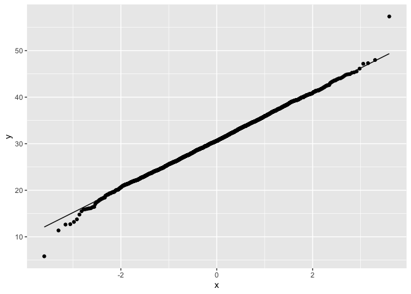

Geog4/6300: Lab 5
================

## Correlation and ANOVA

**Overview** In this lab, you’ll work with county level election and
census data to answer two questions: (1) how did association between the
presidential vote (measured by vote for the Republican candidate) and
educational attainment change between 2008 and 2016 and (2) Were there
regional differences in the vote for the Republican candidate across
years? To do so, you’ll need to prepare a dataset for analysis and run
chi-square, ANOVA, and post-hoc (TukeyHSD) tests.

Our dataset is drawn from the American Community Survey and [this Github
repository](https://github.com/tonmcg/US_County_Level_Election_Results_08-20)
giving the votes by county in 2008, 2012, and 2016. The ACS data are the
pooled five-year samples for 2006-10, 2010-14, and 2014-18 respectively.
Let’s load the data from the lab folder:

``` r
election_data<-read_csv("data/elections0816_demog_pct.csv")
```

    ## Rows: 9334 Columns: 61
    ## ── Column specification ────────────────────────────────────────────────────────
    ## Delimiter: ","
    ## chr  (6): fips_code, gisjn_cty, county, state, region, division
    ## dbl (55): year, total, dem, gop, oth, totpop, wht_pop, afam_pop, asn_pop, hi...
    ## 
    ## ℹ Use `spec()` to retrieve the full column specification for this data.
    ## ℹ Specify the column types or set `show_col_types = FALSE` to quiet this message.

The raw population counts and rates (percentages) are both included in
this dataset. You can see a description of the variables in the
setup/census_vars.csv variables.

### Part 1: Correlation analysis

In this section, you’ll be measuring the correlation between the gop_pct
(% voting for the Republican) variable and the five variables showing
*highest* level of educational attainment as a rate:

*ed_lesshs_pct: % of population with less than a high school diploma
*ed_hsdiploma_pct: % of population with a high school diploma/GED
*ed_lessba_pct: % of population with some college or an associate’s
degree *ed_ba_pct: % of population with a bachelor’s degree
\*ed_graddeg_pct: % of population with a professional/graduate degree

**Question 1** *To start with, you will need to subset the data to two
separate data frames, one for the 2008 election results and one for
2016. Create these two data frames using the year_txt variable and
select just the region variable (Census region) as well as our variables
of interest (GOP voting and educational attainment). Call the heads of
both using kable when you are done.*

``` r
election2008<-election_data %>%
  filter(year=="2008") %>%
  na.omit(election2008) %>%
  select(region | gop_pct | ed_lesshs_pct | ed_hsdiploma_pct | ed_lessba_pct | ed_ba_pct | ed_graddeg_pct)
kable(head(election2008))
```

| region         |  gop_pct | ed_lesshs_pct | ed_hsdiploma_pct | ed_lessba_pct | ed_ba_pct | ed_graddeg_pct |
|:---------------|---------:|--------------:|-----------------:|--------------:|----------:|---------------:|
| Midwest Region | 45.96622 |      9.449469 |         38.37580 |      33.51972 | 18.655008 |       6.011934 |
| South Region   | 87.02229 |     18.523949 |         30.00978 |      28.98338 | 22.482893 |       5.865103 |
| South Region   | 72.32305 |     24.474929 |         35.68355 |      30.18575 |  9.655775 |       2.758488 |
| South Region   | 46.96133 |     47.198599 |         29.06453 |      16.13307 |  7.603802 |       1.938469 |
| West Region    | 72.03456 |     11.863922 |         34.04803 |      34.81990 | 19.268153 |       6.918239 |
| Midwest Region | 66.55443 |     13.123309 |         38.61616 |      31.94820 | 16.312331 |       3.111712 |

``` r
election2016<-election_data %>%
  filter(year=="2016") %>%
  na.omit(election2016) %>%
  select(region | gop_pct | ed_lesshs_pct | ed_hsdiploma_pct | ed_lessba_pct | ed_ba_pct | ed_graddeg_pct)
kable(head(election2016))
```

| region         |  gop_pct | ed_lesshs_pct | ed_hsdiploma_pct | ed_lessba_pct | ed_ba_pct | ed_graddeg_pct |
|:---------------|---------:|--------------:|-----------------:|--------------:|----------:|---------------:|
| Midwest Region | 60.17220 |      6.069211 |         33.34469 |      39.09587 | 14.663789 |       6.826442 |
| South Region   | 87.67020 |     17.846154 |         33.27473 |      29.40659 | 14.505494 |       4.967033 |
| South Region   | 82.78220 |     19.135500 |         37.09921 |      32.19416 |  7.168586 |       4.402544 |
| South Region   | 44.50377 |     36.136206 |         27.58860 |      25.49389 |  7.812965 |       2.968331 |
| West Region    | 76.48915 |      5.578801 |         28.00558 |      43.29149 | 14.365411 |       8.758717 |
| Midwest Region | 77.27273 |      9.970385 |         36.01185 |      34.66930 | 14.037512 |       5.310958 |

**Question 2** *Next you should assess the normality of the variables of
interest. Use two of the three measures discussed in class (histogram,
QQ plot, and/or Shapiro-Wilk test) to do so for the 2016 data. Based on
your results, is a parametric or non-parametric test needed?*

``` r
shapiro.test(election2016$gop_pct)
```

    ## 
    ##  Shapiro-Wilk normality test
    ## 
    ## data:  election2016$gop_pct
    ## W = 0.95152, p-value < 2.2e-16

``` r
shapiro.test(election2016$ed_lesshs_pct)
```

    ## 
    ##  Shapiro-Wilk normality test
    ## 
    ## data:  election2016$ed_lesshs_pct
    ## W = 0.93476, p-value < 2.2e-16

``` r
shapiro.test(election2016$ed_hsdiploma_pct)
```

    ## 
    ##  Shapiro-Wilk normality test
    ## 
    ## data:  election2016$ed_hsdiploma_pct
    ## W = 0.99334, p-value = 9.254e-11

``` r
shapiro.test(election2016$ed_lessba_pct)
```

    ## 
    ##  Shapiro-Wilk normality test
    ## 
    ## data:  election2016$ed_lessba_pct
    ## W = 0.99847, p-value = 0.00502

``` r
shapiro.test(election2016$ed_ba_pct)
```

    ## 
    ##  Shapiro-Wilk normality test
    ## 
    ## data:  election2016$ed_ba_pct
    ## W = 0.9416, p-value < 2.2e-16

``` r
shapiro.test(election2016$ed_graddeg_pct)
```

    ## 
    ##  Shapiro-Wilk normality test
    ## 
    ## data:  election2016$ed_graddeg_pct
    ## W = 0.81125, p-value < 2.2e-16

``` r
hist(election2016$gop_pct)
```

<!-- -->

``` r
hist(election2016$ed_lesshs_pct)
```

<!-- -->

``` r
hist(election2016$ed_hsdiploma_pct)
```

<!-- -->

``` r
hist(election2016$ed_lessba_pct)
```

<!-- -->

``` r
hist(election2016$ed_ba_pct)
```

<!-- -->

``` r
hist(election2016$ed_graddeg_pct)
```

<!-- -->

``` r
ggplot(election2016,aes(sample=gop_pct)) +
  stat_qq()+
  stat_qq_line()
```

<!-- -->

``` r
ggplot(election2016,aes(sample=ed_lesshs_pct)) +
  stat_qq()+
  stat_qq_line()
```

<!-- -->

``` r
ggplot(election2016,aes(sample=ed_hsdiploma_pct)) +
  stat_qq()+
  stat_qq_line()
```

<!-- -->

``` r
ggplot(election2016,aes(sample=ed_lessba_pct)) +
  stat_qq()+
  stat_qq_line()
```

<!-- -->

``` r
ggplot(election2016,aes(sample=ed_ba_pct)) +
  stat_qq()+
  stat_qq_line()
```

<!-- -->

``` r
ggplot(election2016,aes(sample=ed_graddeg_pct)) +
  stat_qq()+
  stat_qq_line()
```

<!-- -->

{Based on my results, a non-parametric test is needed.}

**Question 3** *Now you can assess correlation in each year. Use the
rcorr function from the Hmisc package to analyze the correlation of our
variables of interest in 2008 and 2016 using the Pearson or Spearman’s
test (depending on normality). Save the results of each function to an
object and then call it in your code so the correlation is visible in
this knitted lab document.*

``` r
election2008 %>% mutate_if(is.character, as.factor)
```

    ## # A tibble: 3,111 × 7
    ##    region         gop_pct ed_lesshs_pct ed_hsdiploma_pct ed_le…¹ ed_ba…² ed_gr…³
    ##    <fct>            <dbl>         <dbl>            <dbl>   <dbl>   <dbl>   <dbl>
    ##  1 Midwest Region    46.0          9.45             38.4    33.5   18.7     6.01
    ##  2 South Region      87.0         18.5              30.0    29.0   22.5     5.87
    ##  3 South Region      72.3         24.5              35.7    30.2    9.66    2.76
    ##  4 South Region      47.0         47.2              29.1    16.1    7.60    1.94
    ##  5 West Region       72.0         11.9              34.0    34.8   19.3     6.92
    ##  6 Midwest Region    66.6         13.1              38.6    31.9   16.3     3.11
    ##  7 South Region      42.3          8.42             17.5    26.6   47.4     8.82
    ##  8 South Region      45.3         14.9              26.2    30.6   28.2     5.23
    ##  9 South Region      77.4         18.5              35.6    30.3   15.6     3.24
    ## 10 South Region      77.3         27.7              36.4    23.2   12.7     3.03
    ## # … with 3,101 more rows, and abbreviated variable names ¹​ed_lessba_pct,
    ## #   ²​ed_ba_pct, ³​ed_graddeg_pct

``` r
election2016 %>% mutate_if(is.character, as.factor)
```

    ## # A tibble: 3,110 × 7
    ##    region         gop_pct ed_lesshs_pct ed_hsdiploma_pct ed_le…¹ ed_ba…² ed_gr…³
    ##    <fct>            <dbl>         <dbl>            <dbl>   <dbl>   <dbl>   <dbl>
    ##  1 Midwest Region    60.2          6.07             33.3    39.1   14.7     6.83
    ##  2 South Region      87.7         17.8              33.3    29.4   14.5     4.97
    ##  3 South Region      82.8         19.1              37.1    32.2    7.17    4.40
    ##  4 South Region      44.5         36.1              27.6    25.5    7.81    2.97
    ##  5 West Region       76.5          5.58             28.0    43.3   14.4     8.76
    ##  6 Midwest Region    77.3          9.97             36.0    34.7   14.0     5.31
    ##  7 South Region      37.9          7.26             15.4    25.5   32.6    19.3 
    ##  8 South Region      45.0         10.6              23.6    34.0   20.5    11.3 
    ##  9 South Region      83.8         14.9              33.8    33.8   13.1     4.39
    ## 10 South Region      84.0         24.5              36.3    26.4    7.82    5.03
    ## # … with 3,100 more rows, and abbreviated variable names ¹​ed_lessba_pct,
    ## #   ²​ed_ba_pct, ³​ed_graddeg_pct

``` r
election2016_2<-election2016 %>%
  select(gop_pct | ed_lesshs_pct | ed_hsdiploma_pct | ed_lessba_pct | ed_ba_pct | ed_graddeg_pct)

election2008_2<-election2008 %>%
  select(gop_pct | ed_lesshs_pct | ed_hsdiploma_pct | ed_lessba_pct | ed_ba_pct | ed_graddeg_pct)

election2016_cor<-rcorr(as.matrix(election2016_2), type="spearman")
election2008_cor<-rcorr(as.matrix(election2008_2), type="spearman")

rcorr(as.matrix(election2008_2), type="spearman")
```

    ##                  gop_pct ed_lesshs_pct ed_hsdiploma_pct ed_lessba_pct ed_ba_pct
    ## gop_pct             1.00          0.16             0.16          0.03     -0.23
    ## ed_lesshs_pct       0.16          1.00             0.22         -0.59     -0.71
    ## ed_hsdiploma_pct    0.16          0.22             1.00         -0.39     -0.66
    ## ed_lessba_pct       0.03         -0.59            -0.39          1.00      0.35
    ## ed_ba_pct          -0.23         -0.71            -0.66          0.35      1.00
    ## ed_graddeg_pct     -0.21         -0.49            -0.58          0.24      0.79
    ##                  ed_graddeg_pct
    ## gop_pct                   -0.21
    ## ed_lesshs_pct             -0.49
    ## ed_hsdiploma_pct          -0.58
    ## ed_lessba_pct              0.24
    ## ed_ba_pct                  0.79
    ## ed_graddeg_pct             1.00
    ## 
    ## n= 3111 
    ## 
    ## 
    ## P
    ##                  gop_pct ed_lesshs_pct ed_hsdiploma_pct ed_lessba_pct ed_ba_pct
    ## gop_pct                  0.0000        0.0000           0.0596        0.0000   
    ## ed_lesshs_pct    0.0000                0.0000           0.0000        0.0000   
    ## ed_hsdiploma_pct 0.0000  0.0000                         0.0000        0.0000   
    ## ed_lessba_pct    0.0596  0.0000        0.0000                         0.0000   
    ## ed_ba_pct        0.0000  0.0000        0.0000           0.0000                 
    ## ed_graddeg_pct   0.0000  0.0000        0.0000           0.0000        0.0000   
    ##                  ed_graddeg_pct
    ## gop_pct          0.0000        
    ## ed_lesshs_pct    0.0000        
    ## ed_hsdiploma_pct 0.0000        
    ## ed_lessba_pct    0.0000        
    ## ed_ba_pct        0.0000        
    ## ed_graddeg_pct

``` r
rcorr(as.matrix(election2016_2), type="spearman")
```

    ##                  gop_pct ed_lesshs_pct ed_hsdiploma_pct ed_lessba_pct ed_ba_pct
    ## gop_pct             1.00          0.18             0.40          0.07     -0.35
    ## ed_lesshs_pct       0.18          1.00             0.32         -0.46     -0.72
    ## ed_hsdiploma_pct    0.40          0.32             1.00         -0.35     -0.72
    ## ed_lessba_pct       0.07         -0.46            -0.35          1.00      0.24
    ## ed_ba_pct          -0.35         -0.72            -0.72          0.24      1.00
    ## ed_graddeg_pct     -0.45         -0.53            -0.62          0.03      0.73
    ##                  ed_graddeg_pct
    ## gop_pct                   -0.45
    ## ed_lesshs_pct             -0.53
    ## ed_hsdiploma_pct          -0.62
    ## ed_lessba_pct              0.03
    ## ed_ba_pct                  0.73
    ## ed_graddeg_pct             1.00
    ## 
    ## n= 3110 
    ## 
    ## 
    ## P
    ##                  gop_pct ed_lesshs_pct ed_hsdiploma_pct ed_lessba_pct ed_ba_pct
    ## gop_pct                  0.0000        0.0000           0.0002        0.0000   
    ## ed_lesshs_pct    0.0000                0.0000           0.0000        0.0000   
    ## ed_hsdiploma_pct 0.0000  0.0000                         0.0000        0.0000   
    ## ed_lessba_pct    0.0002  0.0000        0.0000                         0.0000   
    ## ed_ba_pct        0.0000  0.0000        0.0000           0.0000                 
    ## ed_graddeg_pct   0.0000  0.0000        0.0000           0.1415        0.0000   
    ##                  ed_graddeg_pct
    ## gop_pct          0.0000        
    ## ed_lesshs_pct    0.0000        
    ## ed_hsdiploma_pct 0.0000        
    ## ed_lessba_pct    0.1415        
    ## ed_ba_pct        0.0000        
    ## ed_graddeg_pct

**Question 4** *Use one of the packages discussed in class (ggcorrplot
or corrgram) to create a graphic of the two correlation matrices you
created in question 3.*

``` r
correlation_matrix_2008<-cor(election2008_2)
correlation_matrix_2016<-cor(election2016_2)

ggcorrplot(correlation_matrix_2008,
    lab=TRUE,
    type = "lower", 
    insig = "blank")
```

<!-- -->

``` r
ggcorrplot(correlation_matrix_2016,
    lab=TRUE,
    type = "lower", 
    insig = "blank")
```

<!-- -->

**Question 5** *Based on results from your analysis in questions 3 and
4, evaluate the correlation between the GOP vote and the educational
attainment variables in both 2008 and 2016. focusing on direction,
magnitude and significance. What differences do you see within and
between those two years?*

{For 2008, there is a weak positive correlation between GOP vote and
educational attainment variables ed_lesshs_pct (0.09), ed_hsdiploma_pct
(0.22), and ed_lessba_pct (0.07).The strongest positve correlation
between GOP vote and educational attainment belongs to those in the
ed_hsdiploma_pct (0.22) group. There is a weak negative correlation
between GOP vote and educational attainment variables ed_ba_pct (-0.3)
and ed_graddeg_pct (-0.22). The weakest negative correlation between GOP
vote and educational attainment belongs to those in the ed_ba_pct (-0.3)
group.

For 2016, there is a weak positive correlation between GOP vote and
educational attainment variables ed_lesshs_pct (0.08) and ed_lessba_pct
(0.15). There is a moderately positive correlation between GOP vote and
educational attainment variable ed_hsdiploma_pct (0.46). The strongest
positive correlation between GOP vote and educational attainment belongs
to those in the ed_hsdiploma_pct (0.46) group. There is a moderately
negative correlation between GOP vote and educational attainment
variables ed_ba_pct (-0.41) and ed_graddeg_pct (-0.53). The weakest
negative correlation between GOP vote and educational attainment belongs
to those in the ed_ba_pct (-0.41) group.

Within 2008, the positive correlation between GOP vote and educational
attainment peaks at ed_hsdiploma_pct (0.22), and becomes progressively
weaker as educational attainment increases. The exception is a slightly
weaker correlation for ed_graddeg_pct (-0.22) as compared to ed_ba_pct
(-0.3).

Within 2016, the positive correlation between GOP vote and educational
attainment again peaks at ed_hsdiploma_pct (0.46), and becomes
increasingly weaker as educational attainment increases. This occurs in
a linear fashion.

Between the two years, 2016 possesses a stronger correlation between
educational attainment and GOP vote. There is a moderately positive
correlation between GOP vote and ed_hsdiploma_pct, with the correlation
weakening thereafter and becoming moderately negative as educational
attainment increases. For 2008, the pattern is relatively the same,
albeit with weaker correlation values and the aforementioned discrepancy
between ed_ba_pct (-0.3) and ed_graddeg_pct (-0.22). This suggests that
as time has gone on, there has been an increasing correlation between
educational attainment and GOP vote.}

### Part 2: ANOVA

In this section you’ll calcluate the change in vote for the Republican
candidate by county and then use ANOVA/post-hoc tests to determine if
these changes differed across the four U.S. Census regions.

To start with, you’ll need to calculate that change in vote.

**Question 6** *Subset the dataset you loaded at the start of this lab
so it includes just the region, county fips, year_txt, and gop_pct
variables. Transform this data so the years are wide (individual
columns) rather than long. Then calculate the change in percentage
Republican vote between 2008 and 2016. Call the head of your table when
done.*

``` r
election2008_2016<-election_data %>%
  filter(year=="2008" | year=="2016") %>%
  select(region | fips_code | year | gop_pct) %>%
  pivot_wider(names_from = year, values_from = gop_pct) %>%
  na.omit(election2008_2016) %>%
  mutate_at(c('2008', '2016'), as.numeric) %>%
  rename(year2008='2008', year2016='2016') %>%
  mutate(pct_change_GOP=(year2016-year2008)/(year2008)*100)
kable(head(election2008_2016))
```

| region         | fips_code | year2008 | year2016 | pct_change_GOP |
|:---------------|:----------|---------:|---------:|---------------:|
| Midwest Region | 26041     | 45.96622 | 60.17220 |     30.9052611 |
| South Region   | 48295     | 87.02229 | 87.67020 |      0.7445261 |
| South Region   | 01127     | 72.32305 | 82.78220 |     14.4617178 |
| South Region   | 48389     | 46.96133 | 44.50377 |     -5.2331510 |
| West Region    | 56017     | 72.03456 | 76.48915 |      6.1839589 |
| Midwest Region | 20043     | 66.55443 | 77.27273 |     16.1045531 |

**Question 7** *Create a boxplot that shows the distribution of the vote
change variable you just created in question 6 by census region.
Describe two notable trends shown by this graph.*

``` r
ggplot(election2008_2016,aes(x=region,y=pct_change_GOP))+
  geom_boxplot() +
  theme(axis.text.x = element_text(angle = 45, hjust = 1))
```

<!-- -->

``` r
election2008_2016_2<-election2008_2016 %>%
  filter(pct_change_GOP < 100)
#Removed 1 outlier that made interpreting box plot difficult

ggplot(election2008_2016_2,aes(x=region,y=pct_change_GOP))+
  geom_boxplot() +
  theme(axis.text.x = element_text(angle = 45, hjust = 1))
```

<!-- -->

{Notable trend \#1: The South has the most compact of box plots; this
indicates that it has the least variance regarding % change GOP vote.
Interestingly, while there is a lesser-spread of results, the South
possesses the most outliers.

Notable trend \#2: The median values for each region reside *relatively*
close to the center of each box plot. This indicates that there is
minimal skew to these data. }

**Question 8** *Let’s assume the change variable is normally
distributed. Do an ANOVA analysis of that variable across regions and
call the results. Then run a TukeyHSD test on the output as a post-hoc
test.*

``` r
changeGOP<-aov(pct_change_GOP ~ region, election2008_2016)
summary(changeGOP)
```

    ##               Df Sum Sq Mean Sq F value Pr(>F)    
    ## region         3 141593   47198     218 <2e-16 ***
    ## Residuals   3106 672613     217                   
    ## ---
    ## Signif. codes:  0 '***' 0.001 '**' 0.01 '*' 0.05 '.' 0.1 ' ' 1

``` r
TukeyHSD(changeGOP)
```

    ##   Tukey multiple comparisons of means
    ##     95% family-wise confidence level
    ## 
    ## Fit: aov(formula = pct_change_GOP ~ region, data = election2008_2016)
    ## 
    ## $region
    ##                                       diff        lwr         upr     p adj
    ## Northeast Region-Midwest Region  -9.726892 -12.546860  -6.9069234 0.0000000
    ## South Region-Midwest Region     -13.321446 -14.859282 -11.7836103 0.0000000
    ## West Region-Midwest Region      -17.424861 -19.611567 -15.2381545 0.0000000
    ## South Region-Northeast Region    -3.594555  -6.351297  -0.8378119 0.0045151
    ## West Region-Northeast Region     -7.697969 -10.862835  -4.5331032 0.0000000
    ## West Region-South Region         -4.103414  -6.207955  -1.9988732 0.0000034

**Question 9** *Based on the analysis you did in question 8, was the
change in Republican vote between 2008 and 2016 different between
geographic regions? If so, which regions appear to be different from
each other? Use the box plot you created in question 9 to describe the
direction of difference as well as significance (e.g., which regions
were higher or lower than others.*

{The change in GOP vote between 2008 and 2016 was different between
regions. The difference was most significant between the Midwest
(highest median pct_change_GOP) and West (lowest median pct_change_GOP).
The smallest of differences was between the South and the Northeast.
Each respective region comparatively differs from one another. The South
had the lowest variablitiy of pct_change_GOP amongst all regions, while
possessing the most outliers. The Northeast possessed the fewest
outliers. The Midwest possessed the highest median pct_change_GOp, while
the West possessed the lowest. These results align with historical
voting trends, as the Northeast is historically a Blue region and the
South a Red, with the West and Midwest being a bit more intermixed.}

**Bonus question** The election data we used for this project also
includes median income. In 2012, what was the correlation between median
income and the GOP vote share for the whole country? Then pick two
regions and calculate the correlation between these variables in each
one. Present your results and explain what they tell you about the
relationship between these variables country wide and within each of the
regions you chose focusing on the direction and magnitude of the
correlation.

``` r
#Code here
```

{Discussion here.}

**Lab reflection:** *How do you feel about the work you did on this lab?
Was it easy, moderate, or hard? What were the biggest things you learned
by completing it?*

{I felt that I did fine on this lab. It was moderately challenging at
times; conceptually speaking, I knew what commands I wanted to execute,
however putting those commands in R syntax is what was the most
challenging for me. For example, learning that the “region” variable was
impeding me from executing the correlaton analysis in Q3 was a bit of a
hangup. Also, having to rename the year variables in Q6 to not be
numeric in nature so that I could write the mutate formula in a way that
R recognizes was another hangup. Learning little nuiances such as these
were the biggest hangups for me along the way, but I’m glad that I’ve
learned them now and have this understanding going forward.}
